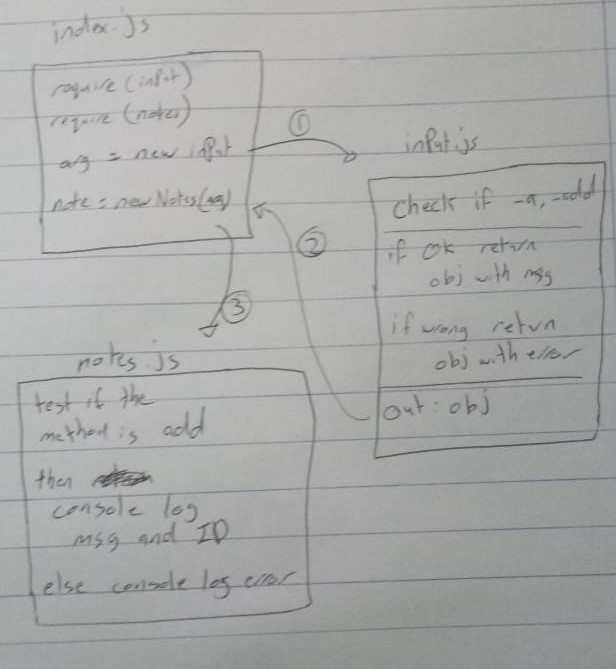

# LAB - Class 04

## Project: Notes

### Author: Ruwaid al sayyed obeid

### Links and Resources

- [submission PR](https://github.com/ruwaid-401-advanced-javascript/notes/pull/5)
- [Github actions](https://github.com/ruwaid-401-advanced-javascript/notes/pull/5/checks)

### Modules
#### `input.js`
### `notes.js`

### Setup

#### How to initialize/run your application 

 * this program can implemnt the CRUD methods
 * Do You need help? type `--help`  
 * to run this file you need to specify the method you want to use
 * add to database -->  `node index.js --add <your note> --category <category name>`
 * list all data in  the database --> `node index.js --list`
 * list specific category --> `node index.js --list <category name>`
 * update notes --> `node index.js --update <note ID> --newnote <your new note>`
 * delete notes --> `node .index.js --delete <note ID>`
 * you can use shortcut for the arguments --> `add: a, list: l, update: u, delete: d , category: c, newnote: n`

#### How to use your library 
#### Tests
- Lint test: `npm run lint`
- unit test: `npm test`

#### UML

